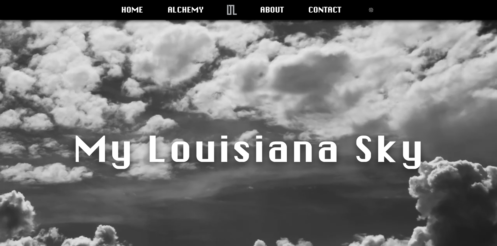

# Clarence Franklin — Portfolio

## Live Demo

[View Live Demo](https://apartment-sigma-beryl.vercel.app/)



## About This Project

This repository contains my personal portfolio site built with React and Vite. It showcases work samples, a modular component structure, a theme context for light/dark modes, and nested routing for multi-level pages (for example, the Alchemy apartment pages). The site is designed to be responsive and accessible across desktop and mobile devices.

## Table of Contents

- [Technologies Used](#technologies-used)
- [Highlights](#highlights)
- [Selected Pages & Projects](#projects)
- [How It Was Built](#how-it-was-built)
- [Run Locally](#run-locally)
- [Future Work](#future-work)
- [Contact](#contact)

## <a name="technologies-used"></a>Technologies Used

- React (v19)
- Vite
- React Router DOM
- Tailwind CSS
- Headless UI & Heroicons

## <a name="highlights"></a>Highlights

- Responsive, component-driven UI with a clear folder structure
- Theme context for persistent light/dark switching
- Nested routing with reusable layout components and child routes
- Mobile-friendly navigation with pointer-event support

## <a name="projects"></a>Selected Pages & Projects

- **Home** — Overview and featured work
- **Alchemy** — Multi-page concept with nested apartment views
  - Apartment → Floorplan, Amenities, Integrated, Overview
- **About** — Personal background and skills
- **Contact** — Contact form and a thank-you page

## <a name="how-it-was-built"></a>How It Was Built

- Feature-based folders under `src/components` for modularity
- `src/contexts/ThemeContext.jsx` provides theme state
- Routing defined in `src/App.jsx` using nested `Routes` and `Outlet`
- Navigation and mobile interactions use `pointer` events for better touch support

## <a name="run-locally"></a>Run Locally

1. Clone the repository:

```bash
git clone <your-repo-url>
```

2. Install dependencies:

```bash
cd my-react-app
npm install
```

3. Start the development server:

```bash
npm run dev
```

Open `http://localhost:5173/` and navigate to hash routes for nested pages (for example: `http://localhost:5173/#/alchemy/apartment/floorplan`).

## <a name="future-work"></a>Future Work

- Add automated tests and CI checks
- PWA support and performance optimizations
- Expand portfolio pages with case studies and demonstrations

## <a name="contact"></a>Contact

- Clarence Franklin
- GitHub: https://github.com/cfra8189

---

© Clarence Franklin
# My React Vite App

## Description

A compact React + Vite starter tailored for responsive multi-page sites. This template includes nested routing, theme context, and a modular component structure suitable for building marketing sites, small dashboards, or single-page applications with multiple nested views.

## Table of Contents

- [Technologies Used](#technologies-used)
- [Features](#features)
- [Planned Enhancements](#planned-enhancements)
- [Deployment](#deployment)
- [About The Author](#about-the-author)
- [Development Process](#development-process)
- [Installation & Setup](#installation--setup)
- [References](#references)

## <a name="technologies-used"></a>Technologies Used

- React — UI library
- Vite — fast development build tool
- React Router DOM — client-side routing
- Tailwind CSS — utility-first styling
- Headless UI & Heroicons — accessible UI primitives and icons

## <a name="features"></a>Features

- Nested routing structure with reusable layout components
- Theme context to toggle light/dark modes across the app
- Responsive navigation with mobile-friendly interactions
- Componentized folder layout for maintainability
- Vite-powered fast dev server and optimized production builds

**In Progress:**

- [ ] Improve accessibility and keyboard navigation across components

## <a name="planned-enhancements"></a>Planned Enhancements

- PWA support for offline usage and installability
- User preferences persistence (theme and UI state)
- Unit and integration tests for critical components
- CI/CD workflow for automated builds and deployments
- Optional server-side rendering or static export for SEO

## <a name="deployment"></a>Deployment

No deployment is configured by default. To publish to a static host (GitHub Pages, Netlify, etc.), either:

- Keep `HashRouter` (used here) for straightforward static hosting, or
- Use `BrowserRouter` and configure the host to fallback to `index.html` for unknown routes.

Build and preview commands:

```bash
npm run build
npm run preview
```

If deploying to GitHub Pages, set the `base` option in `vite.config.js` to the repository path or use the existing `deploy` script if configured.

## <a name="about-the-author"></a>About The Author

- Clarence Franklin — sole author and maintainer

## <a name="development-process"></a>Development Process

- Git feature branches for new work
- Small, focused commits with descriptive messages
- Local development with `npm run dev` using Vite's fast refresh

## <a name="installation--setup"></a>Installation & Setup

1. Clone the repository:

```bash
git clone <your-repo-url>
```

2. Change into the project directory and install dependencies:

```bash
cd my-react-app
npm install
```

3. Start the development server:

```bash
npm run dev
```

4. Build for production:

```bash
npm run build
```

## <a name="references"></a>References

- React documentation — https://react.dev/
- Vite documentation — https://vitejs.dev/
- React Router — https://reactrouter.com/
- Tailwind CSS — https://tailwindcss.com/

---
